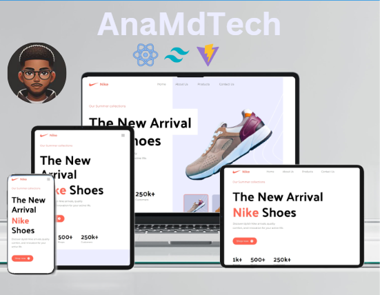

#  Landing Page

## Table of Contents

- [Overview](#overview)
  - [Features](#features)
  - [Preview](#preview)
  - [Live Demo](#live-demo)
- [Getting Started](#getting-started)
  - [Prerequisites](#prerequisites)
  - [Installation](#installation)
  - [Development](#development)
- [Technologies Used](#technologies-used)
- [Responsive Design](#responsive-design)
- [Acknowledgments](#acknowledgments)

---

## Overview

The **Nike Landing Page** is a modern and responsive website built with React, Tailwind CSS, and Vite. It showcases a clean design with interactive features for product previews and dynamic user interaction.

### Features

- **Fully Responsive Design**: Adapts to mobile, tablet, and desktop screens.
- **Interactive Components**: Dynamic shoe previews with hover and click events.
- **Tailwind CSS Styling**: Efficient utility-first CSS framework for rapid UI development.
- **Fast Performance**: Built with Vite for lightning-fast development and build processes.

### Preview



---

### Live Demo
[Visit the Nike Landing Page](https://nike-ana-md.netlify.app/)


## Getting Started

Follow these steps to set up and run the project locally:

### Prerequisites

- **Node.js** and **npm** installed.
- A code editor (e.g., VS Code).

### Installation

1. Clone the repository:
   ```bash
   git clone https://github.com/AnaMdTech/nike-landing-page.git
   ```
2. Navigate to the project directory:
   ```bash
   cd nike-landing-page
   ```
3. Install the dependencies:
   ```bash
   npm install
   ```

### Development

1. Start the development server:
   ```bash
   npm run dev
   ```
2. Open your browser and go to `http://localhost:3000`.

---

## Technologies Used

- **React.js**: Component-based JavaScript library for building user interfaces.
- **Tailwind CSS**: Utility-first CSS framework for styling.
- **Vite**: Modern build tool for fast development.
- **JavaScript (ES6)**: Programming language for dynamic functionality.

---

## Responsive Design

- Mobile-first design with Tailwind CSS media queries.
- Dynamic layouts using Flexbox and Grid.
- Optimized images for different devices:
  - Mobile: Thumbnail images for quick previews.
  - Desktop: High-resolution product images.
- Interactive components styled with Tailwind's hover and transition utilities.

---

## Acknowledgments

This project is inspired by Nike's innovative designs and modern marketing strategies.
